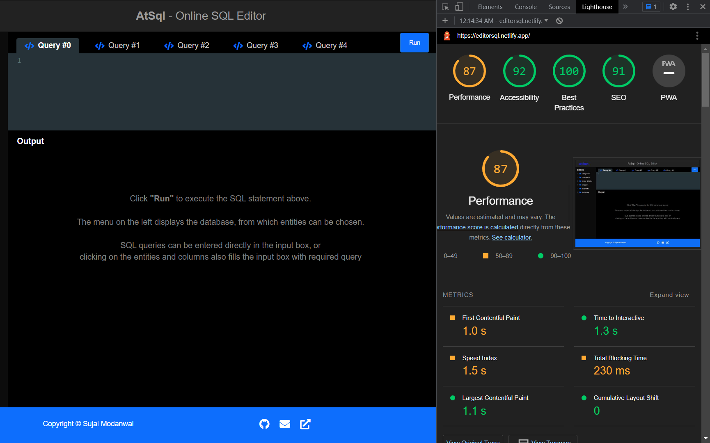

# AtSql - Online Sql Editor

Online Sql Editor created with the help of react, bootstrap, and codemirror (for code editor). 

## Build Setup

In the project directory, you can run:
```
# install dependencies
npm install

# install react-bootstrap 
npm install react-bootstrap bootstrap 

# build for production and launch server
npm run build
npm run start
```

## Demo


## Features
- Includes code-editor to take user input of queries  
- Sql Queries can be auto generated by clicking on the entities and columns displayed on the left
- Queries can also be entered directly into the query box
- Multiple queries can run simultaneously in different input tabs
- Clean and simple layout for the output of tables

## Page Load Time

The page load time of this application has been measured with the help of [Lighthouse](https://developers.google.com/web/tools/lighthouse) which is an automated tool provided by Google.

Below are metrices provided by the Lighthouse to measure page load time. 

| Item                           | Time  |
| ------------------------------ | ----  | 
| FCP (First Contentful Paint)   | 1.0 s |
| SI (Speed Index)               | 1.5 s | 
| LCP (Largest Contentful Paint) | 1.1 s | 
| TTI (Time to Interactive)      | 1.3 s | 
| TBT (Total Blocking Time)      | 230 ms| 
| CLS (Cumulative Layout Shift)  | 0.00  |

### Screenshot:



I took care of the below factors to obtain the optimal page performance.
- I have employed minimal style state management to minimize the data being stored in the form states, so that overall output can be reached without throttling the application.
- Used minified build version of fontawesome instead of react library of fontawesome, to further cutdown the performance cost.